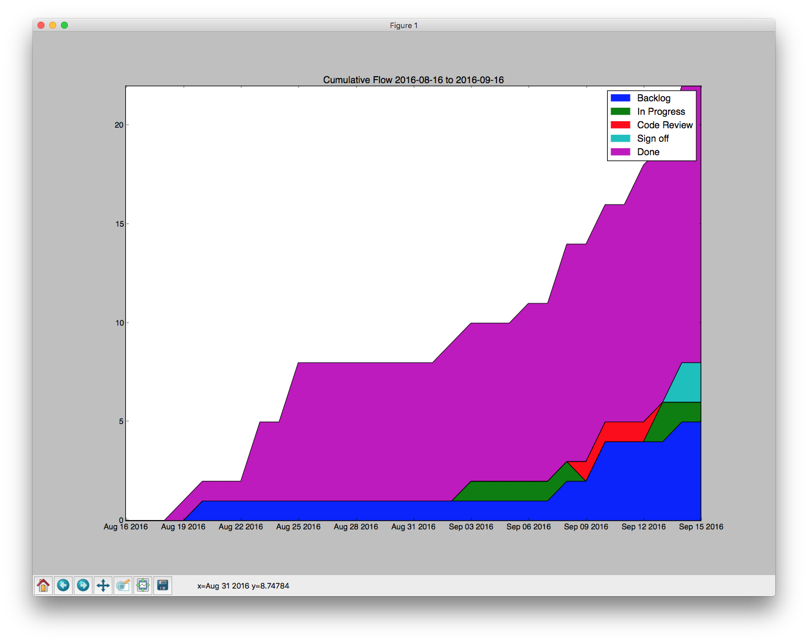

#Description
This is a fork of https://github.com/wikimedia/analytics-limn-analytics-data that produces some Kanban statistics from Phabricator. Additions in this fork:
- Lists all completed task created dates, start dates, end dates, cycle time (time from start to end), lead time (time from creation to end)
- Computes average cycle time, lead time, and throughput
- Generates a CFD (Cumulative Flow Diagram) via `matplotlib`: 

- `phab-stats-config.json` is git ignored (as it should be). Instead copy `phab-stats-config.sample` to `phab-stats-config.json` and modify accordingly.
- Remove all computation related to points (not used in Kanban)

Assumptions:
- When tasks are complete they are resolved in Phabricator and kept in the same workboard; there is no "Done" column in your workboard
- Task start date assumes the task was moved to the in progress column at some point
- In progress column must have value 2 in `phab-stats-config.json`
- The end date passed in args to the script is exclusive (i.e. tasks completed exactly on that date will be ignored in calculations)
- Tasks are created in the backlog (e.g. if tasks are created in the In Progress column directly, the script won't be able to determine a start date)
- Tasks are completed with the "resolved" status (if tasks are completed with other statuses, e.g. wontfix/invalid, the task won't be considered completed for calculations)
- First column in `phab-stats-config.json` is your icebox and will be excluded from CFD
- CFD data will only be accurate if tasks are never moved backward in your workboard

Troubleshooting:
- If you have issues with matplotlib and virtualenv, see http://matplotlib.org/faq/virtualenv_faq.html.
- Getting column IDs for `phab-stats-config.json` is kind of a pain now. To get them you can run `curl https://your_phab.example.com/api/maniphest.gettasktransactions -d api.token=your_token -d ids[0]=some_task_id` and look at the `columnPHIDs` (you have to remember where you moved tasks from/to). Get your API token from the `~/.arcrc` file.
- Getting the PHID of the project for `phab-stats-config.json` is kind of a pain now too. Follow http://stackoverflow.com/a/25754181/62 for now.

#Usage
```
 ./phab-stats --config ./phab-stats-config.json  2015-09-01 2016-01-01
```
#To install

We have seen issues with phabricator 0.0.5 in linux
and phabricator 0.0.4 in mac. Currently we require version 0.0.4
but please see below of Mac OS X instructions.


## Mac OS X
##Install python libs

```
    sudo pip  install -r ./requirements.txt
```
If lxml gives trouble, uninstall and install again.

Please see issue: https://github.com/disqus/python-phabricator/issues/22
You need phabricator 0.0.5 to workarround it

##Install archanist

See guide here: https://gist.github.com/potench/68d48757d0d56842946a

##Install Certificates

Installing certificates should bring up a prompt for you to enter a token:
```
>arc install-certificate https://phabricator.wikimedia.org

CONNECT  Connecting to "https://phabricator.wikimedia.org/api/"...
LOGIN TO PHABRICATOR
Open this page in your browser and login to Phabricator if necessary:

https://phabricator.wikimedia.org/conduit/login/

Then paste the API Token on that page below.

    Paste API Token from that page: cli-blah
Writing ~/.arcrc...
 SUCCESS!  API Token installed.
```
DONE! You should be able to run the script
